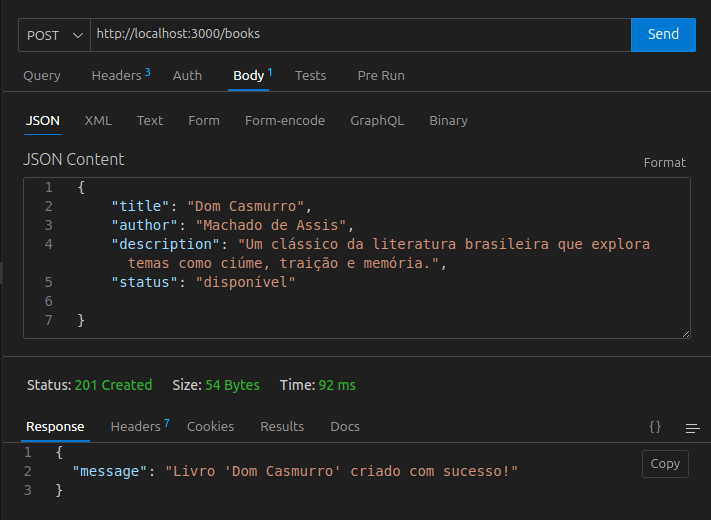

# Projeto Aprofunda: Api Biblioteca - Clean Architecture

Este projeto foi desenvolvido como parte do Programa Aprofunda da PretaLab. A aplicação consiste em uma API de biblioteca conectada ao **MongoDB**, com autenticação **JWT** para proteger rotas sensíveis.  
Foi implementado também uma estrutura mínima de **registro e login de usuários**,  garantindo boas práticas de segurança.

##  Tecnologias Utilizadas

- Node.js
- Express
- CORS
- TypeScript
- Thunder Client (para testes manuais)
- Jest (para testes automatizados)
- SuperTest (para testes de integração)
- MongoDB Atlas
- Mongoose
- JWT (JSON Web Token)
- Bcrypt 

## Funcionalidades

A API possui as seguintes rotas:

### POST/users
Cadastra um novo usuário.

Realiza login e retorna um token JWT.

### POST/books
Cria um novo livro.

### GET/books
Lista todos os livros cadastrados.

### PATCH/books
Atualiza os dados de um livro cadastrado.

Retorna um status 404 caso o livro não esteja cadastrado.

### DELETE/books
Remove um livro cadastrado.

Retorna um status 404 caso o livro não esteja cadastrado.

## Testes Automatizados

O projeto possui:

- Testes Unitários (Jest)
- Testes de Integração (SuperTest)

## Cobertura de Testes (Coverage)

A cobertura dos testes foi gerada com o comando `npm run test:coverage`, atingindo **acima de 80%** de cobertura total:

## Conexão com Banco de Dados

A API foi conectada ao MongoDB Atlas utilizando o Mongoose.

Os dados dos livros se encontram em uma coleção chamada `books`, e os dados dos usuários se encontram em uma coleção chamada `users`.

## Arquitetura Utilizada

Este projeto segue os princípios de Clean Architecture, com separação de responsabilidades entre:

- `@types`
- `config`
- `controllers`
- `database`
- `factories`
- `models`
- `repositories`
- `routes`
- `services`
- `shared`
- `storage`
- `tests`
- `app`
- `index`

## Deploy

A aplicação foi configurada para deploy no Render, utilizando:

- `render.yml`
- `Variáveis de ambiente definidas na plataforma`
- `Start command: npm start`

## Autoria

Este projeto foi desenvolvido por **Geovana Mendes**, estudante de Sistemas de Informação, como parte do programa **Aprofunda** da **PretaLab**.
